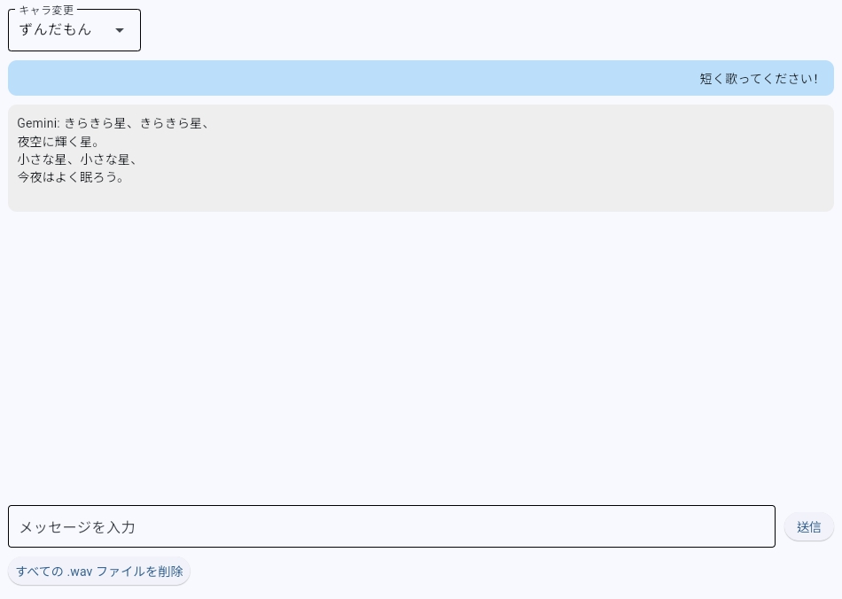

## □概要  
main.pyを起動すると、ダウンロードしたVOICEVOXとアプリが起動します。  
Geminiを使用する時と変わらずで、テキストベースでのやり取りです。  
返答に選択したキャラクターの音声がつきます。
(ずんだもん・四国めたん・春日部つむぎ・黒沢冴白から選択)

main.pyがあるカレントディレクトリに音声ファイルが自動作成されるのでアプリを終了する時などに、  
下側の「すべての .wav ファイルを削除」を押して、音声ファイルの削除推奨です。

## □動作環境  
Python3.11以上

## □前準備
〇VOICEBOXのダウンロード  
公式サイトから取得  
URL：https://voicevox.hiroshiba.jp/

〇Gemini APIの取得  
Google AI Studioから取得  
URL：https://aistudio.google.com/  
・「Get API key」　→　「+ APIキーを作成」 →　「新しいプロジェクトでAPIキーを作成」  
・表示されたAPIキーをコピーし、安全な場所に保存

〇カレントディレクトリに「.env」追加  
・実行ファイルのあるフォルダで右クリック　→　新規作成　→　テキスト　→　ファイル名を `.env` に変更（拡張子 `.txt` は削除)  
・「・env」をプロパティで開いて、「ファイルの種類：ENVファイル」になっていることを確認

〇「.env」に環境変数を追加  
・「.env」をメモ帳アプリなどで開く  
・2つの環境変数に値を入力する  
GOOGLE_API_KEY=取得したGemini APIキーを入力  
　例）GOOGLE_API_KEY=GeminiAPIKeyExample1234567890abcdef  
VOICEVOX_EXE_PATH=VOICEVOXの実行ファイルのパスを入力  
　例）VOICEVOX_EXE_PATH=C:\Users\ユーザー名\AppData\Local\Programs\VOICEVOX\voicevox.exe

〇必要なパッケージをターミナルでインストール  

```bash
pip install flet
pip install flet-audio
pip install python-dotenv
pip install google-generativeai
```

## □その他(APIのリクエスト制限)
アプリの稼働まで料金のかかるものはありませんが、
Gemini API(無料枠)は、 1日あたり（あるいは1分あたり）のリクエスト制限があります。
制限を超えると、
Google Cloudプロジェクトで課金設定が有効になっている場合
自動的に従量課金が発生してしまうので、 自身の課金設定を確認するのが望ましいです。
課金設定が無効の場合は、APIが一時的に使用できなくなり料金の発生はありません。
※Gemini APIのモデルごとのレート制限に関する公式ドキュメント
URL:https://ai.google.dev/gemini-api/docs/rate-limits?hl=ja

〇課金設定の確認の仕方
・Google Cloud ConsoleにGoogle AI Studio でAPIキーを作成したのと同じGoogleアカウントでログイン
URL: https://console.cloud.google.com/
・Google Cloud Console の上部にあるプルダウンメニューをクリック
・APIキーが紐付いているプロジェクトを選択
・左側のナビゲーションメニューから 「お支払い」（Billing）や「課金」を選択
・「リンクされた請求先アカウントに移動」のようなリンクがある場合、次に進む
※「お支払いアカウントが設定されていません」なら課金が無効
・「お支払い」メニューの左側に「お支払い方法」という項目があればクリック
・クレジットカードや銀行口座などの支払い情報が登録されているかどうかを確認
※何も登録されいなければ課金は無効